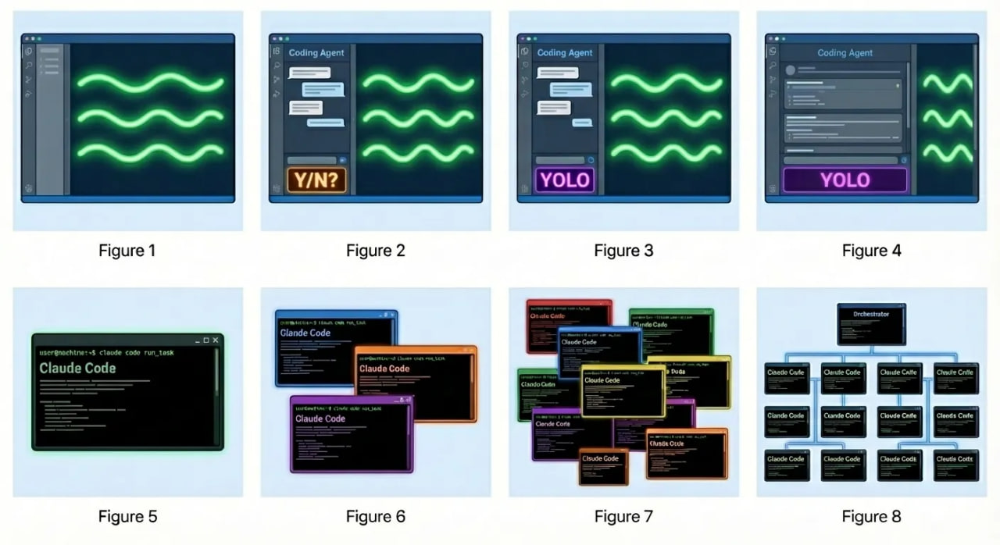
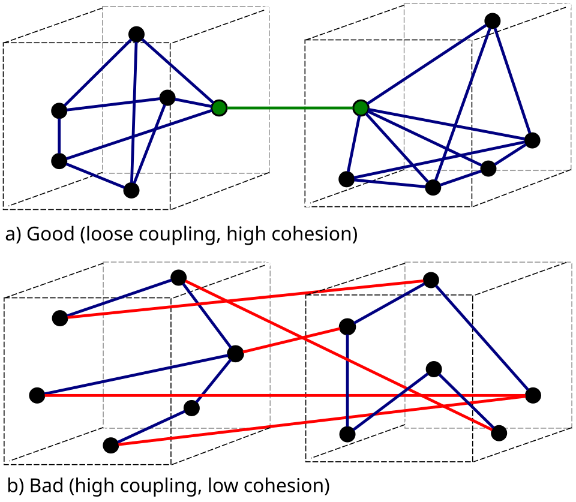
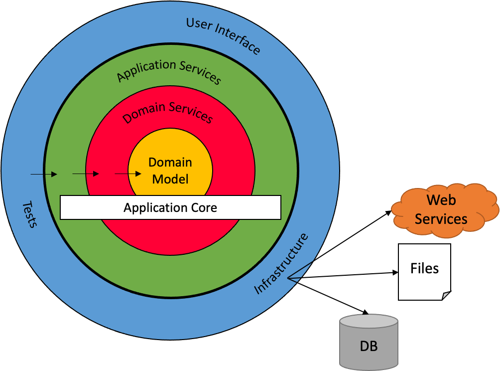
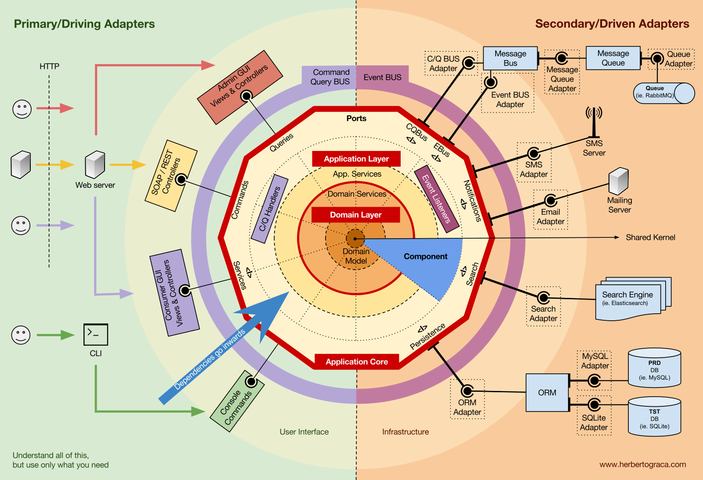

# level85

## Быстрый Старт

- обновите или установите level85 в той же папке, где у вас находятся другие репки:

```
../level85
../calls
../dialogs
```
и т.д.

далее выполните "cd level85 && make" - всё! теперь в любой репке проверьте "`/context`" в claude - должны появиться скилы с префиксом "x-"

### Что под капотом

Taskfile.yml в каждой репке свой, можете добавлять специфичные команды по вкусу. общий Taskfile.yml инклюдится из level85. список команд можно посмотреть по команде "task" без модификатора. теперь можно расширять функционал из одного общего места. только обновляйте локально level85.

настройки всех репок выполнены для main & dev. добавлены ссылки:

- `.agents -> ../level85/.agents`
- `.claude -> .agents`
- `AGENTS.md -> ../level85/AGENTS.md`
- `CLAUDE.md` — содержит `@AGENTS.md`

### Если создаёте новую репку

1. добавить файл Taskfile.yml

```yml
version: "3"
includes:
  common:
    taskfile: ../level85/Taskfile.yml
    flatten: true
```

2. добавить в файл .gitignore

```ini
.golangci.yml
```

3. выполнить "task agents-claude && task lint"

## Настройки claude 

`~/.claude/settings.json`
```json
{
  "permissions": {
    "allow": [],
    "defaultMode": "bypassPermissions",
    "additionalDirectories": []
  },
  "statusLine": {
    "type": "command",
    "command": "bash ~/.claude/statusline-command.sh"
  },
  "extraKnownMarketplaces": {
    "claude-plugins-official": {
      "source": {
        "source": "github",
        "repo": "anthropics/claude-plugins-official"
      }
    }
  },
  "language": "russian",
  "effortLevel": "medium",
  "voiceEnabled": false,
  "skipDangerousModePermissionPrompt": true
}
```

скопировать:
```bash
cp ../level85/scripts/statusline-command.sh ~/.claude/
```

...и установить зависимости:
```
brew install jq
```

## Как я раньше обходился без этого?!

- установить голосовой ввод: [Handy](https://handy.computer/) или [FluidVoice](https://altic.dev/fluid)

- установить [Ghostty](https://ghostty.org/)

## Весёлые картинки

### эволюция вайб-кодера


### связанность и связность (coupling-vs-cohesion)
<div style="background: white; display: inline-block;">
    
</div>

### луковичная архитектура (onion-arch)


### ячеистая архитектура (honest-arch)


